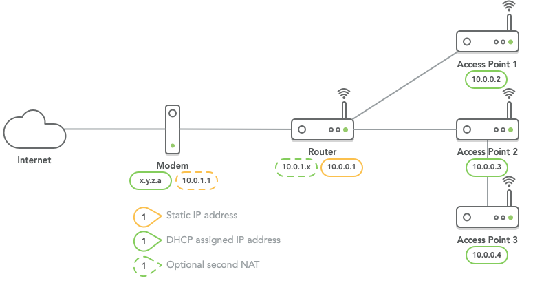

# OpenWrt configuration for router + dumb access points with Ansible playbook for centralised management

An OpenWrt configuration for a network with a single router and multiple
wireless access points. The network has the following characteristics:

* One router, multiple _dumb access points_.
* One SSID across both 2.4GHz and 5GHz bands.
* One SSID across router and all access points.
* Fast switching/handover between access points.
* Access points can be daisy-chained to other access points.
* A wired connection to a computer can be attached to the router or each access point.
* As much as possible rely on DHCP, no static IP addresses.
* Each device can use its Internet port to connect upstream, all other LAN ports remain available.
* Support for multiple wireless networks, such as a guest or IoT network.

Besides a description of the setup, this repository also includes an
Ansible playbook and inventory to centrally apply configuration changes
to all devices and/or update the firmware version on all devices.

This configuration and the Ansible playbook have been tested with OpenWrt 24.10, and all version since 19.07.
It has at least been tested on TP-Link Archer C7-v5 and TP-Link WDR4300 v1, but in theory any
router supported by OpenWrt should work.

The main branch is based on OpenWrt 24.10. The other branches are the last commit that was used for that version. A lot of improvements from later version
could be backported to older version, if desired.

## Table of content

* [Network topology](#network-topology)
* [Router configuration](#router-configuration)
* [Access point configuration](#access-point-configuration)
* [Ansible configuration](#ansible-configuration)
* [Using Ansible](#using-ansible)

## Network topology



Remarks:
* The IP address range of the main network (here `10.0.0.x`) is configurable.
  Another common ranges are `192.168.1.x` or `192.168.0.x`.
* The second NAT (here `10.0.1.x`) between the modem and the router can be
  avoided if:
  * Router and modem are the same device.
  * Modem can be configured in bridge mode, directly assigning the public IP
    address to the router.
  * The router is connected to an NT device (e.g. fibre).
  * If it cannot be avoided, the router should be configured as the DMZ for
    the modem. In addition, disable security features (such as firewall/
    filtering) on the modem. The OpenWrt router will handle all security.

## Router configuration

The router configuration is pretty basic. This covers the most basic settings. Other
things can be configured as desired.

### Packages

* Remove the package _wpad-basic-mbedtls_.
* Install the packages _wpad-mbedtls_ and _luci-app-dawn_.

### System

Set a Hostname for the router, e.g. _router_.

### Interfaces

**LAN**

The LAN has the only static IP configuration. Because this is the main router, the
IP address usually end with `.1`.

* Set the protocol to _Static address_.
* Set the IPv4 address to the desired first address (e.g. `10.0.0.1`).
* Set the network mask to `255.255.255.0`
* Set IPv6 suffix to `::1`.
* Under DHCP server > General Setup:
  * Set Start to be a little higher that the amount of router+access points. E.g.
    when using one router and two access point (total three devices), set the start
    to _5_.
* Under DHCP server > IPv6 settings:
  * Set Router-Advertisement-Service to _server mode_.
  * Set DHCPv6-Service to _server mode_.
  * Set NDP Proxy to _disabled_.
  * Set SLAAC to _enabled_.

**WAN**

* Set the protocol to _DHCP client_.

**WAN6**

* Set the protocol to _DHCPv6 client_.

### Wireless

Each channel is configured in the same way (with one exception, see below). The basic
settings are:

* Set the mode to _Access point_.
* Set ESSID to the desired network name.
* Under Wireless Security:
  * Set the desired encryption level.
  * Set a wireless passphrase in Key.
  * Enable 802.11r Fast Transition.

### DHCP and DNS

* Set Local server to _/home.arpa/_.
* Set Local domain to _home.arpa_.

All access points use DHCP instead of static addresses. This allows for a more flexible
setup, and easy configuration is case something fails. Because each access point uses
DHCP, they will always be reachable from the router. Even if the IP address of the router
would change, all access points will automatically get an IP address in the same range.

The router has an IP address ending with `.1`. So the first access point will be configured
to have an address ending in `.2`, the second access point an address ending in `.3` etc.
The same goes for the IPv6 suffixes. The router has `::1`, the first access points `::2` etc.

It's easiest to do this configuration as the last step. If each access point is already
configured with DHCP, a lot of the fields can be selected from the list.

* Under Static leases, give a static IP to each access point.
  * Set the Hostname for each access point. Access points will be available as
    `https://ap-hostname.home.arpa`. This should be the same name 
  * Set/Select the Mac-Address of each access point.
  * Set the IPv4 Address of each access point (type the address instead of selecting it
    from the list, e.g. `10.0.0.2`).
  * Set/Select the DUID of each access point.
  * Set the IPv6-Suffix of each access point.

## Access Point configuration

Each access point is configured in the same way. 

### Packages

* Remove the package _wpad-basic-mbedtls_.
* Install the package _wpad-mbedtls_ and _dawn_.

### System

Set a Hostname for the access point. If there are multiple access points, it is good
to use numbers, e.g. _ap1_ or _ap2_.

### Startup (services)

Disable the services _dnsmasq_, _firewall_, _odhcpd_.

### Switch

If the device has switch functionality, this has to be changed. Normally this creates
separate VLANs between the Internet port and the LAN ports. Because the router and all
access points act as one network, this is not needed. It also allows to connect the access
point's Internet port to the router's LAN port. All LAN ports of the access points can be used
as well to connect other devices (including other access points.)

If there are multiple VLANs on one switch, delete all accept the first one. For the one remaining
VLAN, set CPU (eth0) to _tagged_. Set all other ports (LAN1, LAN2, ...) and WAN to _untagged_.

### Interfaces

Delete the WAN and WAN6 interfaces.

**LAN**

* Set the protocol to _DHCP client_.
* Under Physical Settings make sure _Bridge interfaces_ is selected, and the Interfaces
  are set to _eth0.1,wlan0,wlan1_.

**LAN6**

Create a new interface with the name LAN6.

* Set the protocol to _DHCPv6 client_.
* Under Physical Settings make use _Bridge interfaces_ is **not** selected.
* Set Interfaces to _@lan_. This creates LAN6 as an alias of the LAN interface.
  It ensures that each access point can also fully use IPv6. 

### Wireless

Use the exact same configuration as for the router.

### DHCP and DNS

This does not have to be configured because the services for dnsmasq and odhcpd are disabled.

## Ansible configuration

Included here as well is an Ansible playbook that can (re)configure and/or update all the
OpenWrt devices on the network. This allows for central management and common configuration
across all access points. The configuration when applied is as described above. However, every
setup is unique, so the configuration files and inventory needs to be adapted to each specific
network.

Most settings can be changed from the `inventory-sample.yaml` file. There is a sample file that can be
used to adapt to your network. The file `home.yaml` is the inventory file for my local
network. Because it contains passwords and other sensitive data, this file is encrypted.

The Ansible playbook can be used to configure a router/access point after a new installation/factory
reset of OpenWrt, provided that:
* The router/access point has a known IP address (either static or via DHCP).
* An SSH key is set that allows for access from the computer running Ansible.

### Inventory configuration

See the file `inventory-sample.yaml` for options that can be configured. Everything can be either
configured on a global level (`openwrt.vars`), on a group level (`routers.vars` and `aps.vars`)
or on an individual device level. If configuration must be different per group or device, a configuration
key can be moved from a higher level to a lower level (i.e. from global to group or device, or from
group to device). Shared configuration can also be moved to a higher level.

Each device needs at least the following configuration, and this cannot be moved to a higher level:
* name: network name of the device
* mac: MAC address of the Internet port of the device (or the port that is connected to the upstream
  device; modem/router/other access point).
* id: unique numerical id, used to calculate the IP address for the device

### SSL certificate

If you want to access the Luci interface via HTTPS you need to include include an SSL certificate.
This can be generated with the following commands:

1. Generate a root certificate:
```
openssl ecparam -out rootCA.key -name prime256v1 -genkey
openssl req -x509 -new -nodes -key rootCA.key -sha256 -days 3650 -subj "/C=NL/O=home/CN=home.arpa Root Certificate" -out rootCA.crt
```
This root certificate can be installed in a browser, so the Luci certificate is accepted.
The root certificate for the example certificates is included in `certs/rootCA.crt`.

2. Generate a certificate for the router and access points:
```
openssl ecparam -out router.key -name prime256v1 -genkey
openssl req -new -sha256 -key router.key -subj "/C=NL/O=home/CN=router.home.arpa" -reqexts SAN -config <(cat /etc/ssl/openssl.cnf <(printf "\n[SAN]\nsubjectAltName=DNS:router.home.arpa,IP:10.0.0.1,DNS:ap1.home.arpa,IP:10.0.0.2,DNS:ap2.home.arpa,IP:10.0.0.3")) -out router.csr
openssl x509 -req -in router.csr -CA rootCA.crt -CAkey rootCA.key -CAcreateserial -out router.crt -days 730 -sha256 -extfile <(cat /etc/ssl/openssl.cnf <(printf "[SAN]\nsubjectAltName=DNS:router.home.arpa,IP:10.0.0.1,DNS:ap1.home.arpa,IP:10.0.0.2,DNS:ap2.home.arpa,IP:10.0.0.3")) -extensions SAN
openssl x509 -in router.crt -outform DER -out uhttpd.crt
openssl ec -in router.key -outform DER -out uhttpd.key
```
Place the files _uhttpd.crt_ and _uhttpd.key_ in the certs directory and they are automatically installed
on the router and each accesspoint. The certificates in this example is valid for the main router and access
points _ap1.home.arpa_ and _ap2.home.arpa_. If you have more access points, changed the names, or are using a different IP range, change the command to generate the certificate to match your settings.

### Upgrading firmware (optional)

Place the OpenWrt firmware images inside the _firmware_ directory. The playbook will automatically
find the newest version and flash that on a device. If there are different models in the same network,
the firmware files can all be placed in the same directory. If in the inventory file each device (or
group of devices) is configured with a _model_ it will select the latest firmware with the model name
in the filename.

## Using Ansible

### Requirements for local machine

* Ansible
* Ansible openwrt plugin, can be installed with
```
ansible-galaxy install gekmihesg.openwrt
```
* openssl (for generating the password in _/etc/shadow_ for the root user)

### Running Ansible playbook

```
ansible-playbook --inventory inventory.yaml openwrt.yaml
```
or add the option `--check` to perform a dry-run first without applying any changes.
